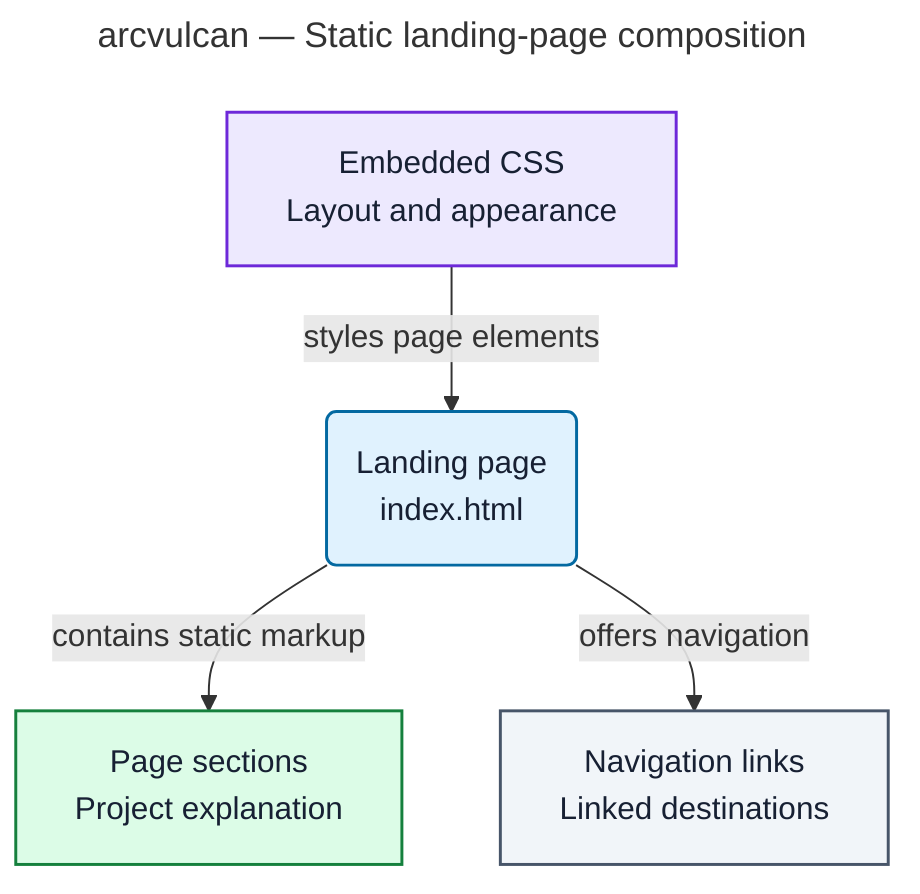

# arcvulcan — Project Atlas

The default gh-pages branch is one static HTML landing page describing the ArcVulcan project.

Based on source at [`fdc95237`](https://github.com/MGrinch/arcvulcan/tree/fdc952370dac56878f813cd4a6be927bcbabef0e), inspected 23 September 2026. This is a source-backed overview, not a live-service status report.

**Read the colors:** blue = entry/person; purple = processing; green = data/artifact; amber = rules/checks; slate = external/reference. Each box also names its responsibility. Arrows have explicit verbs; dashed arrows are labeled planned or inferred.

## Static landing-page composition

[Open full-size diagram](overview.svg) · [Editable source](overview.mmd)

The default gh-pages branch is one static HTML landing page describing the ArcVulcan project.

**Read this boundary:** The current default branch contains only index.html. Marketing descriptions of a tutor do not demonstrate the tutor implementation on this branch.

Editable Mermaid preview

### Component key

| Component | Responsibility |
| --- | --- |
| Landing page | Entry / person — index.html |
| Page sections | Data / artifact — Project explanation |
| Embedded CSS | Processing — Layout and appearance |
| Navigation links | External / reference — Linked destinations |

**Scope limit:** Other branches and deployed-site availability are not asserted.

## How this was prepared

The [design brief and adversarial review](DESIGN-REVIEW.md) records the challenged assumptions, corrected drawing instructions, every arrow’s evidence and exact source hashes. [The shared visual standard](STYLE.md) explains the research, palette and notation. `model.json` stores the structured drawing model.

Static source relationships and documented workflows are confirmed by the cited baseline unless marked planned or inferred. Runtime health, external integrations, learning efficacy and user acceptance were not tested by creating these diagrams.

Maintenance: revisit the cited sources when behavior changes, revise the model and review first, then regenerate the Mermaid/SVG. Keep each role’s color stable across projects.
